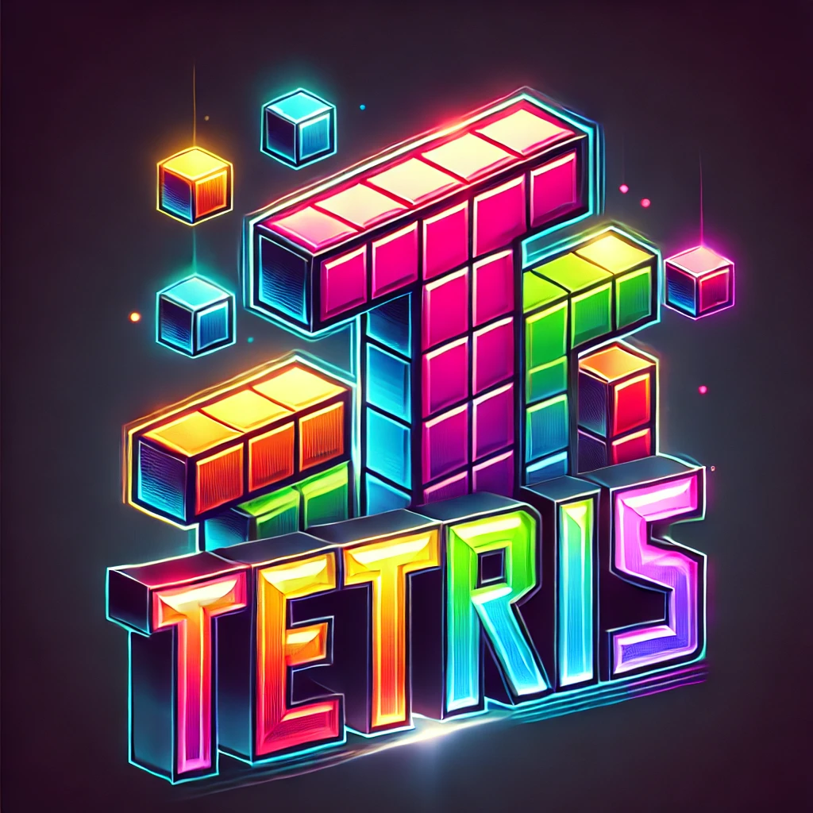

# Tetris mit Gimmicks | Tetris with Gimmicks


<p align="center">
  
</p>

[English](#english) | [Deutsch](#deutsch)

---

<a name="english"></a>
## 🇬🇧 English

A modern Tetris clone with special gimmicks, built with Python and Pygame.

### ✨ Features

- Classic Tetris gameplay with modern extensions
- Attractive, animated main menu with particle effects
- Modern look with 3D effects and particle animations
- Special gimmick blocks with various effects:
  - **Slow Motion**: Slows down block falling
  - **Time Lapse**: Accelerates block falling
  - **Line Explosion**: Removes blocks in the vicinity
  - **Gravity Change**: Changes the direction of falling blocks
- Preview function for the next Tetromino
- Shadow preview showing where the current Tetromino will land
- Point and level system with increasing difficulty
- User-friendly navigation with confirmation dialogs

### 🎮 Controls

- **A/D**: Move Tetromino left/right
- **S**: Fall faster
- **W**: Hard drop
- **Space**: Rotate Tetromino
- **P**: Pause
- **R**: Restart
- **ESC**: Return to main menu (with confirmation dialog)
- **Y/N**: Confirm/Cancel in dialogs

### 🚀 Installation

1. Make sure Python (3.7 or higher) is installed
2. Install the required packages:
   ```
   pip install -r requirements.txt
   ```
3. Start the game:
   ```
   python main.py
   ```

### 📋 Requirements

- Python 3.7+
- Pygame 2.5.2+

### 🧭 Navigation

- **Main Menu**: Shows control information and game options
- **Game**: The actual Tetris gameplay
- **ESC key in game**: Opens a confirmation dialog to return to the main menu
- **Main Menu -> Game**: Press any key in the main menu
- **Game -> Main Menu**: Press ESC and confirm with "Y"

### ❓ Troubleshooting

If you experience problems with the game, try the following steps:

1. **Game not responding**:
   - Restart the game
   - Check if your system meets the minimum requirements
   - Reduce graphics settings in config.py

2. **Performance issues**:
   - Close other resource-intensive programs
   - Reduce the number of particle effects
   - Disable shadow preview

3. **Known issues**:
   - Slower computers may experience lag with many gimmick effects
   - At high levels, collision detection may become less accurate

### 🏆 Scoring System

- 1 Row: 100 × Level
- 2 Rows: 300 × Level
- 3 Rows: 500 × Level
- 4 Rows: 800 × Level
- Line Explosion: Additional 50 × Level

The level increases with every 10th removed row, increasing falling speed and points per row.

### 📜 License

© 2025 - Made with love for classic games

---

<a name="deutsch"></a>
## 🇩🇪 Deutsch

Ein moderner Tetris-Klon mit speziellen Gimmicks, erstellt mit Python und Pygame.

### ✨ Funktionen

- Klassisches Tetris-Gameplay mit modernen Erweiterungen
- Attraktives, animiertes Hauptmenü mit Partikeleffekten
- Moderne Optik mit 3D-Effekten und Partikelanimationen
- Spezielle Gimmick-Blöcke mit verschiedenen Effekten:
  - **Zeitlupe**: Verlangsamt das Fallen der Blöcke
  - **Zeitraffer**: Beschleunigt das Fallen der Blöcke
  - **Linienexplosion**: Entfernt Blöcke in der Umgebung
  - **Gravitationsänderung**: Ändert die Fallrichtung der Blöcke
- Vorschaufunktion für das nächste Tetromino
- Schatten-Vorschau, wohin das aktuelle Tetromino fallen wird
- Punkte- und Levelsystem mit steigender Schwierigkeit
- Benutzerfreundliche Navigation mit Bestätigungsdialogen

### 🎮 Steuerung

- **A/D**: Tetromino nach links/rechts bewegen
- **S**: Schneller fallen
- **W**: Sofort fallen lassen (Hard Drop)
- **Leertaste**: Tetromino drehen
- **P**: Pause
- **R**: Neustart
- **ESC**: Zurück zum Hauptmenü (mit Bestätigungsdialog)
- **J/N**: Bestätigen/Abbrechen in Dialogen

### 🚀 Installation

1. Stellen Sie sicher, dass Python (3.7 oder höher) installiert ist
2. Installieren Sie die benötigten Pakete:
   ```
   pip install -r requirements.txt
   ```
3. Starten Sie das Spiel:
   ```
   python main.py
   ```

### 📋 Anforderungen

- Python 3.7+
- Pygame 2.5.2+

### 🧭 Navigation

- **Hauptmenü**: Zeigt Steuerungsinformationen und Spieloptionen
- **Spiel**: Das eigentliche Tetris-Gameplay
- **ESC-Taste im Spiel**: Öffnet einen Bestätigungsdialog zur Rückkehr zum Hauptmenü
- **Hauptmenü -> Spiel**: Drücken Sie eine beliebige Taste im Hauptmenü
- **Spiel -> Hauptmenü**: Drücken Sie ESC und bestätigen Sie mit "J"

### ❓ Fehlerbehebung

Wenn Sie auf Probleme mit dem Spiel stoßen, versuchen Sie folgende Schritte:

1. **Spiel reagiert nicht mehr**:
   - Starten Sie das Spiel neu
   - Überprüfen Sie, ob Ihr System die Mindestanforderungen erfüllt
   - Reduzieren Sie die Grafikeinstellungen in config.py

2. **Performanceprobleme**:
   - Schließen Sie andere ressourcenintensive Programme
   - Reduzieren Sie die Anzahl der Partikeleffekte
   - Deaktivieren Sie die Schatten-Vorschau

3. **Bekannte Fehler**:
   - Auf älteren Computern kann es zu Verlangsamungen kommen
   - Bei sehr schnellem Spiel kann die Kollisionserkennung ungenauer werden

### 🏆 Punktesystem

- 1 Reihe: 100 × Level
- 2 Reihen: 300 × Level
- 3 Reihen: 500 × Level
- 4 Reihen: 800 × Level
- Linienexplosion: Zusätzliche 50 × Level

Das Level steigt mit jeder 10. entfernten Reihe, wodurch die Fallgeschwindigkeit zunimmt und mehr Punkte pro Reihe erzielt werden können.

### 📜 Lizenz

© 2025 - Entwickelt mit Liebe für klassische Spiele 